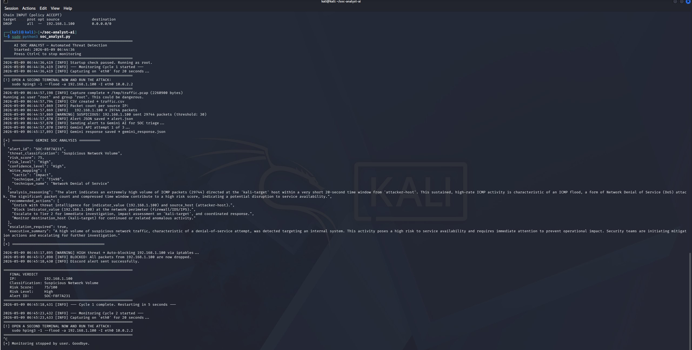
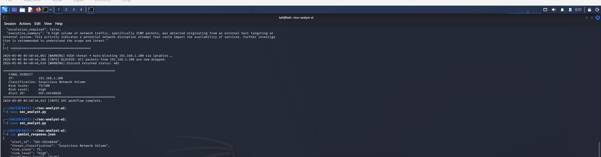
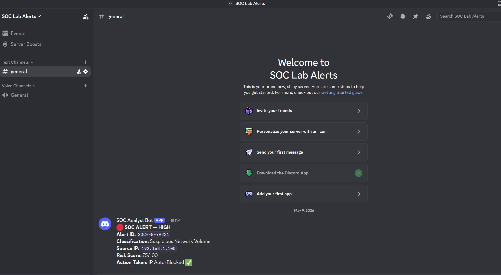
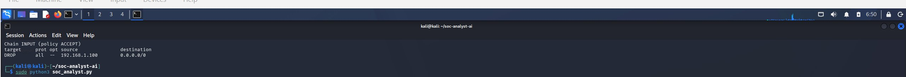
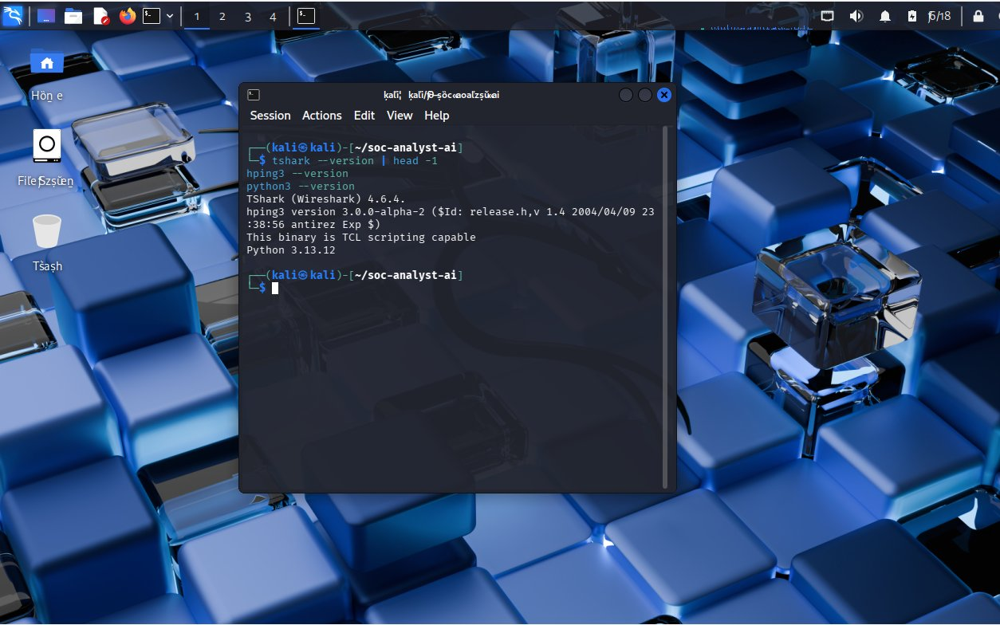

# AI-Powered SOC Analyst Automation System

An automated Security Operations Center (SOC) triage tool that detects network threats in real time, uses Google Gemini AI to analyze and classify them using a professional SOC playbook, auto-blocks attackers via iptables, and sends instant Discord alerts.

## What It Does

- Captures live network traffic using TShark
- Detects suspicious packet volumes from source IPs
- Sends structured alert data to Gemini AI for SOC triage
- AI classifies threat using MITRE ATT&CK framework
- Auto-blocks attacker IP via iptables if risk is High or Critical
- Sends real-time Discord notification with full alert summary
- Runs continuously — monitors 24/7 until manually stopped
- Logs every action to soc_log.txt for full audit trail

## Architecture

hping3 (simulated attack)
       ↓
   TShark (packet capture on eth0)
       ↓
 Python Script (detects threshold breach)
       ↓
  Gemini AI (SOC triage using 10-section playbook)
       ↓
  ┌─────────────────────────────┐
  │  iptables (auto-block IP)   │
  │  Discord (real-time alert)  │
  └─────────────────────────────┘

## Technologies Used

| Tool | Purpose |
|---|---|
| Python 3 | Core automation script |
| TShark | Live packet capture |
| hping3 | Attack simulation |
| Google Gemini 2.5 Flash API | AI-powered SOC triage |
| MITRE ATT&CK Framework | Industry-standard threat classification |
| iptables | Active IP blocking (automated response) |
| Discord Webhooks | Real-time SOC alerting |

## Sample AI Analysis Output

{
  "threat_classification": "Suspicious Network Volume",
  "risk_score": 75,
  "risk_level": "High",
  "confidence_level": "High",
  "mitre_mapping": {
    "tactic": "Impact",
    "technique_id": "T1498",
    "technique_name": "Network Denial of Service"
  },
  "escalation_required": false,
  "executive_summary": "A high volume of ICMP traffic was detected targeting an internal system, indicating a potential denial of service attempt that could impact service availability. Security teams should investigate and consider containment measures."
}

## Screenshots

### Full Pipeline Run

### Gemini AI SOC Analysis

### Discord Real-Time Alert

### Auto-Block via iptables

### Environment Setup

## Installation

git clone https://github.com/Praneeth-oss/soc-analyst-ai
cd soc-analyst-ai
pip install -r requirements.txt

Add your Gemini API key and Discord webhook to soc_analyst_demo.py, then:

sudo python3 soc_analyst_demo.py

## Simulate an Attack (For Testing)

In a second terminal:

sudo hping3 -1 --flood -a 192.168.1.100 -I eth0 10.0.2.2

The script detects the flood automatically, sends it to Gemini AI for triage, blocks the IP, and fires a Discord alert — all without human input.

## Disclaimer

This tool is built for educational and defensive security purposes only.
All testing was performed in an isolated lab environment on machines I own.
Do not use against any network without explicit written permission.

## Author

Praneeth Pentakota
B.Tech Information Technology — Chandigarh University
LinkedIn: https://linkedin.com/in/praneethpentakota
GitHub: https://github.com/Praneeth-oss
